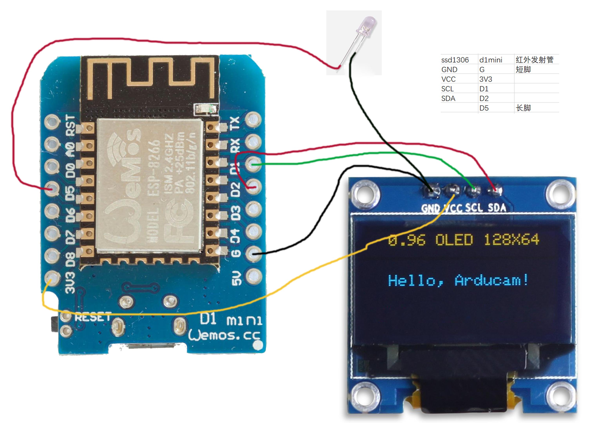

# FEATURES

- [x] 对接巴法云，实现小程序/网页/其它智能家居控制
- [x] 天猫精灵控制
- [x] 显示时钟/网络状态

# TODO

- [ ] 通电自动恢复上次保存的所有配置

- [ ] 在线ota升级

- [ ] 开关空调

- [ ] 切换模式（制冷/制热两种）

- [ ] 温度调整

# How To Use

- 下载代码，打开本目录

- 修改global.cpp中的配置项

- 配置点片机，接线看下边的图

- 用arduino打开ESP8266_Clock_12864SSD1306.ino文件，选择单片机/串口，然后点击上传

- 刷好了之后，打开手机wifi，连上esp-8266这个wifi，密码跟WiFi名一样

- 连上热点之后，打开浏览器，打开到192.168.4.1，然后配置WiFi，输入巴法云的密钥和主题名，点击提交
  
  
