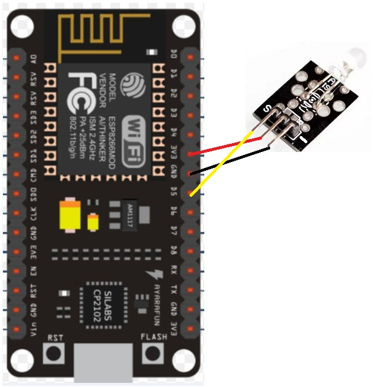

# FEATURES

- [x] 开关空调
- [x] 切换模式（制冷/制热两种）
- [x] 温度调整
- [x] 对接巴法云，实现小程序/网页/其它智能家居控制
- [x] 天猫精灵控制
- [x] 局域网内在线网页配置，支持的配置：空调/巴法云/wifi信息

# TODO

- [ ] 通电自动恢复上次保存的所有配置
- [ ] 在线ota升级

# 使用

- 下载代码，打开本目录
- 修改global.cpp中的配置项
- 配置点片机，接线如下图

